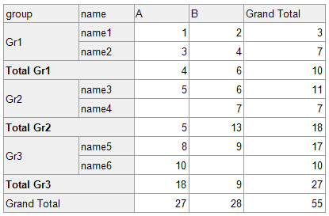
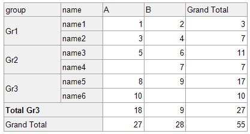
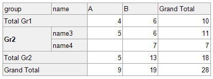
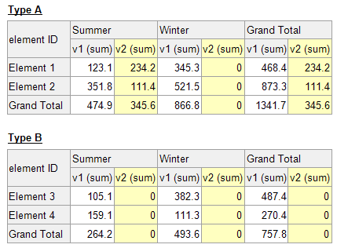
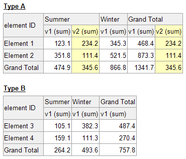
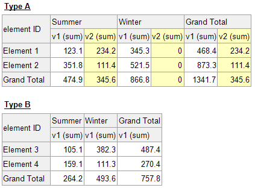

<!-- default badges list -->

[](https://supportcenter.devexpress.com/ticket/details/T1091977)
[](https://docs.devexpress.com/GeneralInformation/403183)
[](#does-this-example-address-your-development-requirementsobjectives)
<!-- default badges end -->
# Reporting - CrossTab Control Customization

The project contains sample reports in which you can learn how to customize the XRCrossTab control.
Run the project, in the application window select the desired example, and click the **Design** button to show the report. 

## How to Hide Cells, Rows and Columns That Meet Certain Conditions


### Hide Totals

The Crosstab control has the `name` data field in rows, the `store` data field in columns, the `value` data field in data area. The `name` rows are grouped by the `group` data field.

The original report preview is shown below:



The report in this example hides the totals for the **Gr1** and **Gr2** group field values, so only the **Gr3** total remains.

Implementation:

Select the row header cell for the Totals row. The cell's coordinates are [0, 2], the name is _crossTabHeaderCell3_, and the cell displays the 'Total[group]' text in the Report Designer.
Invoke the Expression Editor and assign the following expression to the [RowVisible](https://docs.devexpress.com/XtraReports/DevExpress.XtraReports.UI.CrossTab.XRCrossTabCell.RowVisible) property:
```
[group] == 'Gr3'"
```
The resulting report preview is shown in the follolwing image:



### Hide Detailed Records and Show the Total for the Specified Group

The Crosstab control has the `name` data field in rows, the `store` data field in columns, the `value` data field in data area. The `name` rows are grouped by the `group` data field.

The original report preview is shown below:


The report in this example hides the records in the **Gr1** group. The **Gr1** group total remains, the records and totals for other groups remain as well.

Implementation:

Select the row header cell in the row bound to the `[group]` field. The cell coordinates are [0, 1], the cell name is _crossTabHeaderCell2_, and the cell displays the `[group]` text in the Report Designer.
Invoke the Expression Editor and assign the following expression to the [RowVisible](https://docs.devexpress.com/XtraReports/DevExpress.XtraReports.UI.CrossTab.XRCrossTabCell.RowVisible) property:
```
[group] != 'Gr1'
```
Note that a cell located in a nested group can access a data field bound to the parent (outer) group, but cannot access a data field bound to the child (inner) group. This means that this expression would work when assigned to the adjacent row header at the left with coordinates [1,1], which displays the `[name]` text in the Report Designer. However, this is impractical, because the number of calculations increases several times.

The resulting report preview is shown in the following image:



### Hide Empty Rows or Columns With Null, Zero or No Values

The Crosstab control has the `elementID` data field in rows, the `season` data field in columns, the `value1` and `value2` data fields in the data area. The `value2` field is 0 (zero) for several records whose `elementType` field is **Type A**, and is missing for the records whose `elementType` field is **Type B**.


An empty column/row can appear in the following situations: 

- **Type A.** Certain column/row items have no values for a particular field when the control displays several data fields.
- **Type B.** Column/row values are null (a 0 (zero) may be displayed, but there is no value).

Depending on the location of the data fields, horizontally or vertically, an empty column or an empty row may appear. 

The original report preview is shown below:



The report in this example hides a column/row if it has no non-zero values (missing, equal to null, or equal to 0).

Implementation:

Select the Total cell for the column bound to the `[value2]` field. The cell coordinates are [2, 3]; the cell name is _crossTabTotalCell4_.
Invoke the Expression Editor and assign the following expression to the [ColumnVisible](https://docs.devexpress.com/XtraReports/DevExpress.XtraReports.UI.CrossTab.XRCrossTabCell.ColumnVisible) property:

```
[value2] > 0
```

Assign the same expression to the [ColumnVisible](https://docs.devexpress.com/XtraReports/DevExpress.XtraReports.UI.CrossTab.XRCrossTabCell.ColumnVisible) property of the _crossTabTotalCell6_ with coordinates [4,3] to hide the corresponding totals.

The resulting report preview is shown in the following image:



### Hide Rows or Columns With Null or No Values

The Crosstab control has the `elementID` data field in rows, the `season` data field in columns, the `value1` and `value2` data fields in the data area. The `value2` field is 0 (zero) for several records whose `elementType` field is **Type A**, and is missing for the records whose `elementType` field is **Type B**.

An empty column/row can appear in the following situations: 
- **Type A.** Certain column/row items have no values for a particular field when the control displays several data fields.
- **Type B.** Column/row values are null (a 0 (zero) may be displayed, but there is no value).

The original report preview is shown below:


The report in this example hides the column/row if it has no values (or values equal to null), but displays the column/row if it has any values, including 0 (zero).

Implementation:

1. Create a `cfValue2` calculated field with the following expression:
    ```
    [value2]
    ```
2. Drag the newly created calculated field from the Field List window and drop it onto the CrossTab control's data area.
3. Select the cell bound to the `cfValue2` field and change the [SummaryType](https://docs.devexpress.com/XtraReports/DevExpress.XtraReports.UI.CrossTab.CrossTabDataField.SummaryType) to **Count**.
4. Select the **Total** cell for the column bound to the `[value2]` field. The cell coordinates are [2, 3]; the cell name is _crossTabTotalCell4_.
    Invoke the Expression Editor and assign the following expression to the [ColumnVisible](https://docs.devexpress.com/XtraReports/DevExpress.XtraReports.UI.CrossTab.XRCrossTabCell.ColumnVisible) property:

    ```
    [cfValue2] > 0
    ```
5. Select the **Total** cell for another column bound to the `[value2]` field. The cell coordinates are [5, 3]; the cell name is _crossTabTotalCell6_.
    Invoke the Expression Editor and assign the following expression to the [ColumnVisible](https://docs.devexpress.com/XtraReports/DevExpress.XtraReports.UI.CrossTab.XRCrossTabCell.ColumnVisible) property:

    ```
    [cfValue2] > 0 
    ```
6. Hide all columns and rows bound to the `cfValue2` calculated field. For this, set the [ColumnVisible](https://docs.devexpress.com/XtraReports/DevExpress.XtraReports.UI.CrossTab.XRCrossTabCell.ColumnVisible) property to **false** for cells [3,3] and [6,3] in the data area.

The resulting report preview is shown in the following image:


 

## Documentation

- [XRCrossTab](https://docs.devexpress.com/XtraReports/DevExpress.XtraReports.UI.XRCrossTab)
- [ColumnVisible](https://docs.devexpress.com/XtraReports/DevExpress.XtraReports.UI.CrossTab.XRCrossTabCell.ColumnVisible)
- [RowVisible](https://docs.devexpress.com/XtraReports/DevExpress.XtraReports.UI.CrossTab.XRCrossTabCell.RowVisible)

<!-- feedback -->
## Does this example address your development requirements/objectives?

[](https://www.devexpress.com/support/examples/survey.xml?utm_source=github&utm_campaign=reporting-crosstab-customization&~~~was_helpful=yes) [](https://www.devexpress.com/support/examples/survey.xml?utm_source=github&utm_campaign=reporting-crosstab-customization&~~~was_helpful=no)

(you will be redirected to DevExpress.com to submit your response)
<!-- feedback end -->
